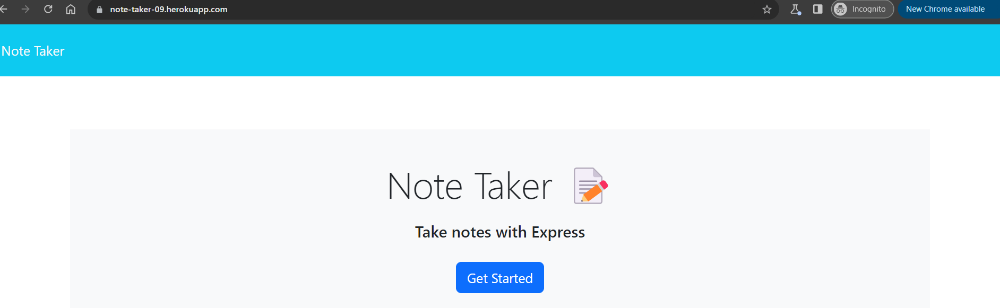
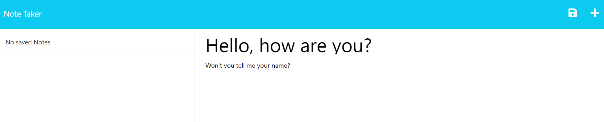
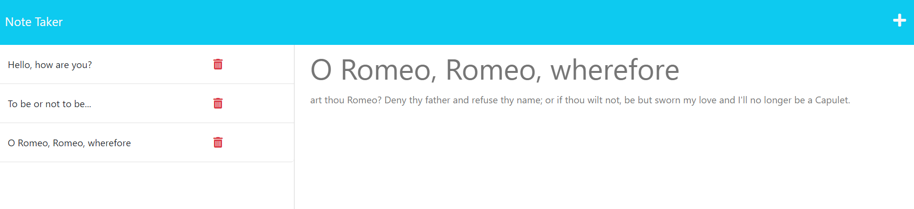

# Note Taker App

## Table of Contents

- [Description](#description)
- [Installation](#installation)
- [Usage](#usage)
- [Credits](#credits)
- [Technologies](#technologies)
- [License](#license)

## Description

This Note Taker app can be used to create, view, edit, save and delete notes. The application's front end was already provided, and the challenge was to create an Express.js back end that will save and retrieve user-generated entries from a JSON file. 

GitHub repository: https://github.com/LauSmi/note-taker-app

Heroku deployment: https://note-taker-09.herokuapp.com/

Link to video walk-through: https://watch.screencastify.com/v/wkrdRE0uLi4GjHNpzHCI

Screenshots:

## Installation

To install necessary dependencies, run the following command in the terminal: npm i express

## Usage

Once all the packages have been installed, open terminal and run the following:

node server.js

This will run the server where you can find the page on localhost:3001.

## Credits

University of Minnesota lectures and materials.

Starter code: https://github.com/coding-boot-camp/miniature-eureka

For references and tutorials:

https://w3schools.com
https://developer.mozilla.org/en-US
https://github.com/

## Technologies

Express.js
Node.js
HTML
CSS
JavaScript

## License

Licensed under the MIT license.